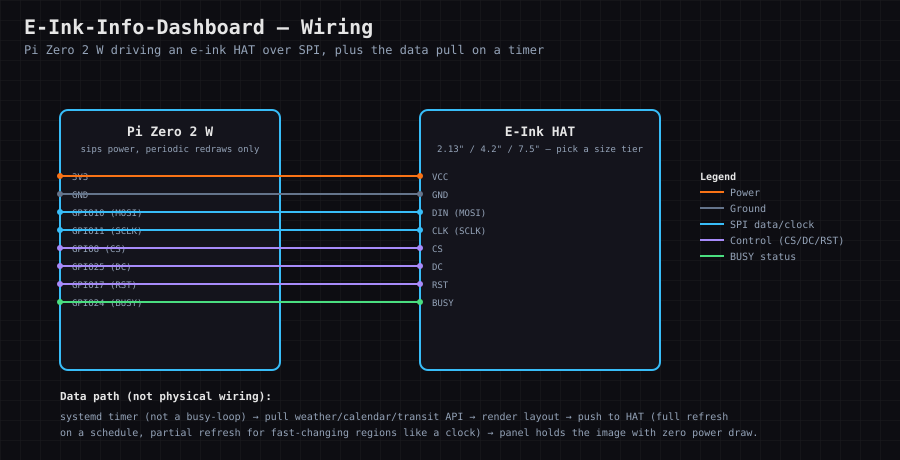

# E-Ink-Info-Dashboard

### A low-power, always-visible display (weather, calendar, transit) that only updates when the content changes — the "small always-on service" idea, in physical form.

 [](LICENSE-GPL) [](LICENSE-AGPL)

[🎮 Interactive Tour](docs/interactive/index.html) · [📋 Cheat Sheet](docs/CHEATSHEET.pdf) · [📖 Full Lesson](docs/LESSON.pdf) · [🔗 Resources](docs/RESOURCES.pdf) · [📖 Lesson Plan](docs/LESSON_PLAN.md)

<!-- SCREENSHOT PLACEHOLDER: docs/screenshots/overview.png -->

Part of **Chain K — Hardware & Systems Foundations**. A smaller, focused sibling to the "small
always-on services" part of **Raspberry-Pi-Tinkering**'s own scope.

## What this is

E-ink is the opposite of every screen most projects reach for: it draws essentially no power once an
image is set, is readable in direct sunlight, and stays legible with the Pi powered off entirely. That
makes it the right display for something meant to just sit on a wall or desk and be glanced at — closer
to a picture frame than a monitor. The four lessons build from the physical reality up to the design
decisions: understand why e-ink holds an image with zero power, get the real partial-vs-full-refresh
tradeoff right (including the ghosting it causes if you skip full refreshes), design the actual
low-power service around a systemd timer instead of a busy-loop, then design a layout that deliberately
splits rarely-changing content from frequently-changing content. Trigger real ghosting and clear it
with a full refresh in the **Refresh & Ghosting Simulator** tab before it's a real panel you're waiting
several seconds on.

## Prerequisites

| Requirement | Notes |
|---|---|
| A modern browser | Chrome, Firefox, Safari, or Edge — the interactive tour is a single HTML file, no install |
| Python 3.8+ (for the exercises) | Check with `python3 --version` |
| An e-ink panel + Raspberry Pi (optional for the tour/exercises) | Only needed for a real build — the tour and exercises need nothing but a browser and Python |

## Items Needed

- [ ] An e-ink display HAT/module — see [Hardware Buying Guide](#hardware-buying-guide-what-to-look-for--red-flags) below (check the controller chip and driver library before buying)
- [ ] A Raspberry Pi Zero 2 W (or similar) and a microSD card
- [ ] A stand or picture frame for mounting
- [ ] Nothing else required for the tour or exercises — just a browser and Python

## Quick Start

1. **Open the interactive tour.** Double-click `docs/interactive/index.html` — no server, no build step.
2. **Work Lesson 1 (E-ink fundamentals)**, then open the **Refresh & Ghosting Simulator** tab and
   notice the "static" pixels never need re-driving once set.
3. **Work Lesson 2 (Partial vs full refresh)**, then advance the simulated clock several times using
   only partial refresh and watch the ghosting gauge climb.
   > ⚠️ **You may get stuck here:** if ghosting keeps climbing no matter how many partial refreshes you
   > apply, that's expected — a target that keeps changing never converges under partial refresh alone.
   > Trigger a full refresh instead and watch it drop to 0% in one step.
4. **Do the skeleton-code exercise.**
   ```bash
   cd exercises
   python3 -m venv .venv && source .venv/bin/activate
   pip install pytest
   pytest -v
   ```
   You'll see 8 failing tests. Open `exercises/eink_refresh.py` and implement the four functions —
   full instructions in [`exercises/README.md`](exercises/README.md).
5. **Work Lesson 3 (Low-power service design)** and sketch the two systemd timers described in the
   practice section.
6. **Work Lesson 4 (Layout for slow-updating screens)** and sketch your own panel's regions on paper.
7. **Then the Quiz**, then Flashcards/Match/Pop Quiz for review.
8. **Check the Report Card tab** any time. Click **Print / Save as PDF** to keep a dated copy in `docs/`.

## Exercise Overview

| # | Lesson | Concept | Refresh & Ghosting Simulator tie-in |
|---|---|---|---|
| 1 | E-ink fundamentals | Bistability, reflective display | *(conceptual — no simulator panel)* |
| 2 | Partial vs full refresh | Ghosting, convergence math | The whole simulator — partial/full refresh + ghost score |
| 3 | Low-power service design | systemd timer vs busy-loop/cron | *(design exercise — no simulator panel)* |
| 4 | Layout for slow-updating screens | Static vs dynamic regions | *(design exercise — no simulator panel)* |

**Learning path:**
```
Lesson 1 (fundamentals)  →  Lesson 2 (refresh & ghosting)  →  Lesson 3 (service design)  →  Lesson 4 (layout)
                                       ↓
                      Refresh & Ghosting Simulator + exercises/ (eink_refresh.py)
                                       ↓
                      Quiz → Flashcards/Match/Pop Quiz → Report Card
```

## Hardware Buying Guide (What to look for & red flags)

**Parts list:** an e-ink display HAT/module (common sizes: 2.13", 4.2", 7.5" — bigger means more content
per glance but slower full-refresh), a Raspberry Pi Zero 2 W (plenty for periodic redraws, and sips power),
a microSD card, and a simple stand or picture frame for mounting.

**What to look for:** check the panel's **full refresh time** (can be several seconds — normal for e-ink,
not a defect) and whether it supports **partial refresh** (updates just a region, much faster, useful for
a clock/time display within an otherwise static layout).

**Red flags:** "e-paper" listings with no controller chip specified and no driver library linked —
e-ink panels vary enough between controllers that a generic, undocumented one can mean days of driver
debugging for a beginner.

**Common failure points:** ghosting (faint remnants of the previous image) from skipping periodic full
refreshes in favor of partial-only updates, and treating it like a normal display that redraws
continuously — e-ink is designed to be written rarely, not polled.

## Wiring Diagram

A standard SPI HAT connection — power/ground plus six control lines (MOSI, SCLK, CS, DC, RST, BUSY). The
physical wiring is identical across all three panel-size tiers; only the panel itself and its refresh time
change:



## Parts & Pricing

Pulled from the chain-wide [Hardware Shopping List](../HARDWARE_SHOPPING_LIST.md#e-ink-info-dashboard) —
check there for current links; prices drift. **Budget/Mid/Luxury are the same tiers the shopping list calls
Budget/Mid/Premium.**

| Item | Budget | Mid | Luxury |
|---|---|---|---|
| Display | 2.13" Waveshare e-Paper HAT, ~$20 — clock/status only | [4.2" Waveshare e-Paper HAT, ~$35–40](https://www.waveshare.com/4.2inch-e-paper-module.htm) — good content/speed balance | [7.5" Waveshare e-Paper HAT, ~$55–65](https://www.amazon.com/waveshare-7-5inch-HAT-Raspberry-Consumption/dp/B075R4QY3L) — full weather + calendar + transit layout |
| Board | Pi Zero 2 W, ~$15 official / ~$28–35 retail | Same | Same — purpose-built for this, no reason to upgrade |
| Mounting | Any stand or picture frame you already have | A proper picture-frame mount | A custom-printed stand or frame via **3D-Printer-Build** |

Running total: **~$35–50 budget → ~$70–80 luxury**, almost entirely driven by panel size, not the board.

## Why This Matters (Industry Application)

Low-power, infrequently-updated displays are a real embedded-systems category (retail shelf tags, transit
signage, industrial status boards) — understanding *why* you'd choose e-ink over LCD is itself the useful
knowledge here.

## Topics Covered

| Area | What this project covers |
|------|--------------------------|
| E-ink displays | How they differ from LCD/OLED, and why |
| Partial vs. full refresh | Speed/ghosting tradeoffs |
| Low-power design | A Pi Zero running a service that mostly sleeps |
| Data sources | Pulling weather/calendar/transit data on a schedule |
| Layout | Designing for a screen that updates slowly |
| Always-on services | systemd timers instead of a busy-loop |

## How This Connects

Chain K (Hardware & Systems Foundations). A smaller, focused sibling to the "small always-on services"
part of **Raspberry-Pi-Tinkering**'s own scope.

## Project Layout

```
E-Ink-Info-Dashboard/
├── docs/
│   ├── interactive/index.html   # tour: lessons, quiz, flashcards, match, pop quiz, refresh & ghosting simulator, report card
│   ├── LESSON_PLAN.md           # short build-plan reference
│   ├── LESSON.pdf               # the full written lesson, printable
│   ├── CHEATSHEET.pdf           # one-page recap, printable
│   ├── RESOURCES.pdf            # further-reading links, printable
│   └── diagrams/wiring.svg      # SPI wiring diagram
├── exercises/
│   ├── eink_refresh.py          # skeleton — implement the 4 functions
│   ├── test_eink_refresh.py
│   └── README.md
└── README.md                    # this file
```

---
Dual licensed — [GPL v3](LICENSE-GPL) and [AGPL v3](LICENSE-AGPL).
